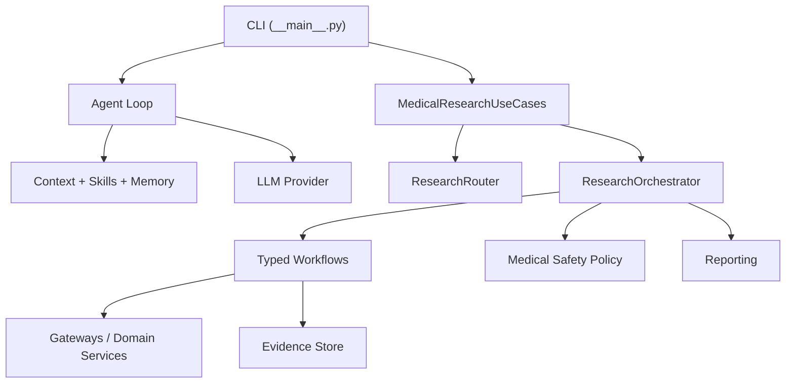
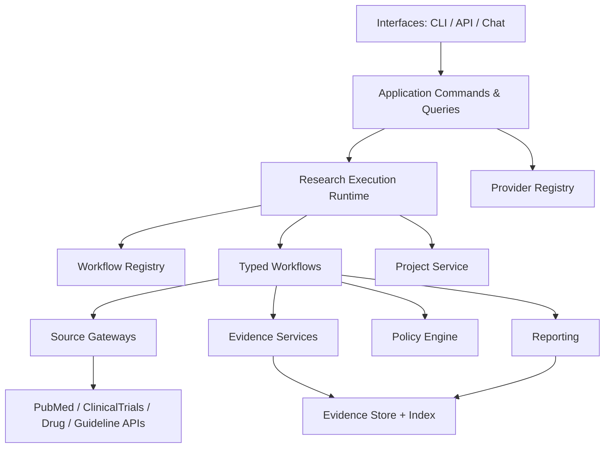

# MedClaw Architecture Optimization

## Executive Summary

MedClaw has already moved away from a pure "chat loop + skills" tool and grown a real medical research runtime:

- typed workflows in `medclaw/workflows/`
- orchestration in `medclaw/orchestrator/`
- structured evidence persistence in `medclaw/evidence/`
- typed application/query responses in `medclaw/application/`
- collection and artifact registry concepts in `workspace/research`

That is real progress. The current architectural problem is no longer "MedClaw lacks structure". The problem is that MedClaw now has **two competing control planes**:

1. the legacy `agent -> context -> skills -> provider` path
2. the newer `application -> orchestrator -> workflow -> evidence` path

As long as both remain first-class, MedClaw will stay harder to reason about, harder to test, and harder to evolve into a focused medical research product.

The optimization direction is therefore:

- make **research execution** the primary runtime
- demote the generic chat loop to a thin interaction shell
- make **evidence and project state** the system center
- turn skills into curated plugins, not the product backbone
- move policy, provider, and interface concerns out of the monolithic CLI path

## Current Architecture

### What Exists Today

MedClaw currently has these major layers:

- **Interface / entrypoint**
  - `medclaw/__main__.py`
- **Conversational agent path**
  - `medclaw/agent/loop.py`
  - `medclaw/agent/context.py`
  - `medclaw/agent/processor.py`
  - `medclaw/agent/skills.py`
- **Application and orchestration**
  - `medclaw/application/use_cases.py`
  - `medclaw/orchestrator/router.py`
  - `medclaw/orchestrator/job_runner.py`
- **Workflow layer**
  - `medclaw/workflows/*.py`
- **Evidence and reporting**
  - `medclaw/evidence/models.py`
  - `medclaw/evidence/store.py`
  - `medclaw/reporting/briefs.py`
- **External source / domain**
  - `medclaw/gateways/medical.py`
  - `medclaw/domain/medical/services.py`
- **Policy**
  - `medclaw/policy/medical_safety.py`
- **Providers**
  - `medclaw/providers/*.py`

### Current Runtime Shape



### What Is Good

- The workflow path is now recognizable and useful.
- Evidence artifacts are persisted instead of living only in chat history.
- Collection and artifact registry concepts are a good foundation for project-oriented research work.
- The provider abstraction exists and can become a real runtime registry.
- The codebase already contains the right nouns: workflow, orchestrator, evidence, collection, artifact, policy.

## Primary Architectural Problems

### 1. Two Competing Control Planes

This is the central issue.

The legacy path:

- `agent/context/processor/skills`
- prompt assembly
- opportunistic tool use
- conversational memory

The newer path:

- `application/use_cases`
- `orchestrator/job_runner`
- typed workflows
- structured evidence and reports

These two paths solve similar problems with different abstractions. That causes:

- duplicate routing logic
- duplicate answer-generation paths
- different guarantees depending on entrypoint
- more surface area to maintain than the product actually needs

### 2. `__main__.py` Is Too Fat

`medclaw/__main__.py` is acting as:

- CLI parser
- response renderer
- provider factory
- system config manager
- research artifact browser
- workflow runner
- validation layer

This makes the entrypoint the de facto integration hub. It is manageable today, but it is the wrong long-term composition root for a medical research platform.

### 3. Application Layer Is Still Thin

`medclaw/application/use_cases.py` mostly passes through to the orchestrator.

Missing application-level responsibilities:

- research project lifecycle
- run lifecycle and checkpoints
- command/query contracts separated from CLI
- permission/policy decisions before execution
- stable internal APIs for non-CLI interfaces

### 4. Orchestrator Is Carrying Too Many Concerns

`medclaw/orchestrator/job_runner.py` currently owns:

- workflow registry
- workflow execution
- collection resolution
- policy application
- evidence persistence
- report rendering coordination
- bundle persistence

That is already too much for a single class. It should become a coordinator over smaller services, not the place where platform policy, persistence, and workflow registry all meet.

### 5. Evidence Model Is Report-Centric, Not Research-Centric

`medclaw/evidence/models.py` is useful, but the center of gravity is still `ResearchReport`, not the research process.

Missing first-class entities:

- `ResearchProject`
- `ResearchRun`
- `SearchStrategy`
- `RetrievalHit`
- `Claim`
- `EvidenceAssessment`
- `ScreeningDecision`
- `StudyQualityAssessment`
- `SynthesisSection`

Without these, MedClaw can save outputs, but it cannot fully explain how the outputs were produced.

### 6. Policy Is Post-Hoc and Weak

`medclaw/policy/medical_safety.py` currently attaches disclaimers and counts citations after the report is built.

That is not enough for a medical research system. Policy should affect:

- whether a workflow is allowed to answer
- whether evidence is sufficient to synthesize claims
- whether recency/freshness checks are required
- whether direct clinical advice must be refused
- whether a report can be marked complete

### 7. Skills Are Still Structurally Over-Present

`medclaw/agent/skills.py` does a better job now by curating runtime skills, but the repository still contains a very large generic skill corpus.

Architecturally, skills should be:

- optional capability extensions
- curated by workflow or domain
- loaded through explicit contracts

They should not remain an alternate product identity.

### 8. Gateway / Domain Boundary Is Still Blurry

There has been progress, but MedClaw still carries both:

- `medclaw/gateways/medical.py`
- `medclaw/domain/medical/services.py`

The split is not yet sharp enough. The code still risks leaking source-specific shapes upward, and source adapters are not separated by bounded data source ownership.

### 9. Provider Runtime Is Not Yet a First-Class Subsystem

The provider abstraction exists, but provider selection, model compatibility, defaults, and runtime capabilities are still mostly handled close to CLI code.

Provider management should become a platform service with:

- provider registry
- capability metadata
- model compatibility matrix
- tool-calling capability matrix
- retry / timeout / error normalization

### 10. Project State Exists, But Execution State Does Not

Collections and artifacts are a good start, but there is still no explicit execution object representing:

- one run
- one workflow invocation
- one retrieval plan
- one synthesis attempt
- one bundle build

That makes re-run, resume, compare, and audit workflows harder than they should be.

## Architectural Reframe

MedClaw should be modeled as **a research execution platform with a conversational shell**, not as a chat agent with research add-ons.

### Target Bounded Contexts

#### 1. Research Execution

Responsibilities:

- workflow selection
- run planning
- workflow execution
- checkpointing
- completion status

Suggested modules:

- `medclaw/application/commands.py`
- `medclaw/application/queries.py`
- `medclaw/orchestrator/runtime.py`
- `medclaw/orchestrator/registry.py`
- `medclaw/workflows/`

#### 2. Evidence and Knowledge

Responsibilities:

- normalized source retrieval
- provenance
- evidence persistence
- claims and citation graph
- artifact index

Suggested modules:

- `medclaw/evidence/models.py`
- `medclaw/evidence/store.py`
- `medclaw/evidence/index.py`
- `medclaw/evidence/assessments.py`

#### 3. Research Project Management

Responsibilities:

- collection/project manifests
- project objectives
- preferred workflows
- project-scoped outputs
- latest bundle state

Suggested modules:

- `medclaw/projects/models.py`
- `medclaw/projects/service.py`
- `medclaw/projects/store.py`

#### 4. Platform Runtime

Responsibilities:

- provider registry
- model registry
- gateway adapters
- cache
- tool execution
- config resolution

Suggested modules:

- `medclaw/platform/providers.py`
- `medclaw/platform/models.py`
- `medclaw/platform/tools.py`
- `medclaw/gateways/`

#### 5. Policy and Governance

Responsibilities:

- research-only boundaries
- citation sufficiency checks
- evidence quality thresholds
- freshness requirements
- prohibited clinical advice enforcement

Suggested modules:

- `medclaw/policy/engine.py`
- `medclaw/policy/rules/`
- `medclaw/policy/contracts.py`

#### 6. Interfaces

Responsibilities:

- CLI
- API
- future chat interfaces

Suggested modules:

- `medclaw/interfaces/cli/`
- `medclaw/interfaces/api/`
- `medclaw/interfaces/chat/`

## Target Architecture



## Concrete Optimization Plan

### Phase 1: Collapse to One Primary Runtime

Goal:

- make typed research execution the main control plane

Actions:

- keep `agent/` only as a thin shell that delegates to application commands
- stop letting `agent/context/skills` be a peer runtime to workflows
- route conversational requests into explicit research commands whenever possible
- move free-form chat to a fallback mode, not the default architecture

Expected code moves:

- shrink `medclaw/agent/processor.py`
- keep `medclaw/agent/loop.py` as interaction orchestration only
- move more decision logic into `medclaw/application/`

### Phase 2: Split the Monolithic CLI

Goal:

- make interface code boring and replaceable

Actions:

- extract CLI handlers from `medclaw/__main__.py` into:
  - `interfaces/cli/research.py`
  - `interfaces/cli/system.py`
  - `interfaces/cli/artifacts.py`
- leave `__main__.py` as typer bootstrap only
- keep rendering helpers out of command definitions

Expected outcome:

- easier testing
- lower coupling between CLI verbs and application services

### Phase 3: Make Application Layer Real

Goal:

- stop treating application as a passthrough

Actions:

- introduce command/query handlers such as:
  - `RunWorkflowCommand`
  - `RunCollectionCommand`
  - `ListArtifactsQuery`
  - `GetCollectionQuery`
  - `UpdateProviderConfigCommand`
- define stable response models at application boundaries
- centralize request validation and policy pre-checks there

Expected outcome:

- CLI, API, and chat interfaces can all call the same internal contract

### Phase 4: Refactor Orchestrator into Smaller Services

Goal:

- remove orchestration, persistence, and registry entanglement

Actions:

- split `ResearchOrchestrator` into:
  - `WorkflowRegistry`
  - `RunCoordinator`
  - `BundleCoordinator`
  - `CollectionResolver`
  - `ReportPersistenceService`

Expected outcome:

- orchestration becomes composable instead of monolithic

### Phase 5: Recenter the Data Model Around Research Runs

Goal:

- make evidence lineage explicit

Add these entities:

- `ResearchProject`
- `ResearchRun`
- `WorkflowRun`
- `SearchStrategy`
- `RetrievalHit`
- `Claim`
- `EvidenceAssessment`
- `ReportArtifact`

Expected changes:

- `ResearchReport` becomes one artifact of a run, not the primary domain object
- bundle summaries become derived artifacts, not top-level orchestration state

### Phase 6: Strengthen Policy from Disclaimer to Gate

Goal:

- make safety architectural

Actions:

- convert `MedicalSafetyPolicy` into a policy engine with rules such as:
  - minimum citation threshold for synthesis
  - explicit refusal for direct diagnosis/treatment requests
  - missing-evidence downgrade rules
  - freshness requirements for trial landscape outputs
  - workflow-specific completion checks

Expected outcome:

- MedClaw can explain not only what it answered, but why it was allowed to answer that way

### Phase 7: Demote Skills to Plugin Status

Goal:

- keep MedClaw focused on medical research, not generic capability sprawl

Actions:

- preserve only curated runtime skills in the product path
- tie each allowed skill to one or more workflows
- define plugin contracts:
  - retrieval plugin
  - enrichment plugin
  - synthesis helper
  - export helper
- keep the full skill catalog out of the default control plane

Expected outcome:

- lower prompt noise
- lower routing ambiguity
- stronger product identity

### Phase 8: Build a Provider Registry

Goal:

- move provider capability decisions out of CLI glue

Actions:

- define provider metadata:
  - direct runtime support
  - supported models
  - tool-calling support
  - structured output support
  - timeout/retry defaults
- make provider selection resolve through a dedicated registry service

Expected outcome:

- system config becomes simpler
- provider compatibility logic stops leaking into interface code

### Phase 9: Add Observability for Research Runs

Goal:

- make runs inspectable and debuggable

Actions:

- persist run metadata:
  - workflow id
  - query
  - selected collection
  - provider/model
  - retrieval counts
  - policy decisions
  - artifact outputs
  - run duration
- add `research runs` and `research run-show` commands later

Expected outcome:

- real audit trail
- easier incident analysis and quality tuning

## Recommended Module Layout

```text
medclaw/
  interfaces/
    cli/
    api/
    chat/
  application/
    commands.py
    queries.py
    handlers/
    responses.py
  orchestrator/
    registry.py
    runtime.py
    bundle.py
  workflows/
  evidence/
    models.py
    store.py
    index.py
    assessments.py
  projects/
    models.py
    service.py
    store.py
  gateways/
    pubmed.py
    clinicaltrials.py
    drugs.py
    guidelines.py
    cache.py
  platform/
    providers.py
    tools.py
    config.py
  policy/
    engine.py
    rules/
```

## Decisions to Make Explicit

These should become written ADRs or short decision docs:

1. Is MedClaw primarily a conversational agent or a research execution engine with chat as a shell?
2. Are collections the same as projects, or should projects become a separate first-class object?
3. Is file-based artifact storage sufficient for the next phase, or is a lightweight structured DB needed for run indexing?
4. Should skills remain repository-local content, or move behind explicit plugin registration?
5. Which provider capabilities are required for "supported runtime" status?

## Recommended Next 3 Implementation Moves

If optimizing for highest architectural leverage, do these next:

1. Extract `__main__.py` into interface modules and leave only bootstrap code in the entrypoint.
2. Introduce `ResearchRun` and `WorkflowRun` as first-class evidence/project entities.
3. Split `ResearchOrchestrator` into registry, coordinator, and persistence services.

Those three changes will do more to stabilize MedClaw than adding more workflows or more skills.

## Final Assessment

MedClaw is no longer a blank-slate project. It already has the right strategic direction. The real requirement now is not another redesign-from-scratch, but a **control-plane consolidation**:

- one primary runtime
- one evidence-centered domain model
- one clean interface boundary
- one explicit policy layer

If MedClaw makes that transition, it can become a credible medical research platform. If it keeps both the generic agent architecture and the typed research architecture equally central, complexity will keep rising faster than product value.
