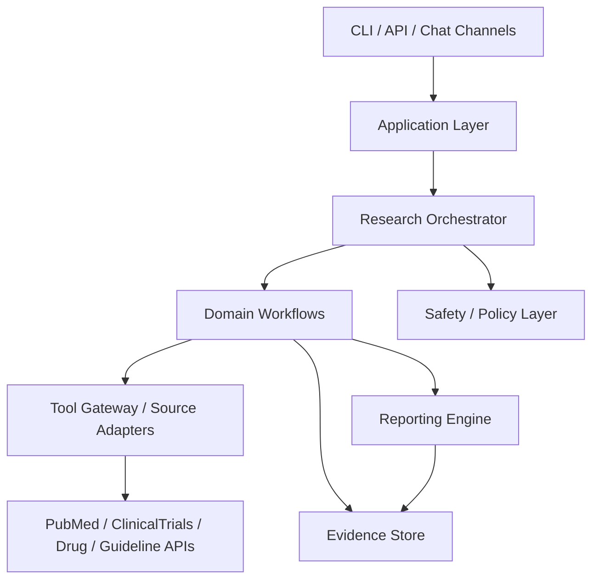

# MedClaw Redesign

## Positioning

MedClaw should be a **medical research copilot**, not a generic skill container with a medical label.

Its primary job is to help users answer research questions such as:

- What is the current evidence for a disease, target, or drug?
- What clinical trials exist and how should they be compared?
- What hypotheses are worth pursuing next?
- How should a study, review, or evidence summary be structured?

That requires an architecture centered on **research workflows, evidence objects, reproducibility, and medical safety**, rather than on free-form prompt assembly.

## Current Architecture Assessment

### What exists today

- A thin CLI and chat loop in [medclaw/__main__.py](/Users/yunxuanhan/Documents/workspace/ai/MedClaw/medclaw/__main__.py) and [medclaw/agent/loop.py](/Users/yunxuanhan/Documents/workspace/ai/MedClaw/medclaw/agent/loop.py)
- Prompt/context construction in [medclaw/agent/context.py](/Users/yunxuanhan/Documents/workspace/ai/MedClaw/medclaw/agent/context.py)
- Skill loading and routing in [medclaw/agent/skills.py](/Users/yunxuanhan/Documents/workspace/ai/MedClaw/medclaw/agent/skills.py)
- A small medical domain adapter layer in [medclaw/domain/medical/services.py](/Users/yunxuanhan/Documents/workspace/ai/MedClaw/medclaw/domain/medical/services.py)
- Provider abstraction in `medclaw/providers/*`

### Strengths

- The project already has a clear “agent + provider + skill + domain service” split.
- The CLI is simple enough to refactor without large compatibility cost.
- There is already a workspace concept for memory, reports, and skills.
- The domain service idea is directionally correct for medical research.

### Main architectural problems

1. The runtime is **chat-first**, not **research-task-first**.
   [medclaw/agent/processor.py](/Users/yunxuanhan/Documents/workspace/ai/MedClaw/medclaw/agent/processor.py) mostly concatenates prompt parts and sends them to the LLM. There is no explicit concept of literature review, trial landscape, evidence synthesis, or study design workflow.

2. The project is **skill-heavy but domain-light**.
   `medclaw/skills/` contains a very large, heterogeneous catalog. That makes MedClaw behave like a generic skill marketplace instead of a focused medical research product.

3. The medical domain layer is too thin.
   [medclaw/domain/medical/services.py](/Users/yunxuanhan/Documents/workspace/ai/MedClaw/medclaw/domain/medical/services.py) exposes direct API wrappers, but there is no normalized evidence model, provenance model, caching layer, or reconciliation logic across sources.

4. There is no durable **research workspace model**.
   Memory is currently conversational. MedClaw needs first-class project artifacts: question definitions, search strategies, evidence tables, screening decisions, synthesized claims, report drafts, and citations.

5. There is no explicit **medical safety and evidence policy layer**.
   The current system prompt says “prioritize accuracy,” but there is no enforcement for citation requirements, uncertainty thresholds, freshness checks, or clinical-vs-research boundaries.

6. The architecture does not separate:
   - orchestration
   - tool execution
   - evidence normalization
   - report generation
   - policy/safety

   Those concerns are currently mixed together in the agent loop and prompt construction path.

## Redesign Goals

### Product goals

- Make MedClaw excellent at 5 core jobs:
  - literature review
  - clinical trial analysis
  - target and drug landscape analysis
  - study design support
  - evidence-backed report generation
- Produce outputs that are traceable, auditable, and reusable.
- Keep the system clinically cautious and research-oriented.

### Non-goals

- Do not try to be a universal scientific assistant.
- Do not expose the full skill corpus by default.
- Do not let free-form prompt routing become the main control plane.

## Design Principles

1. **Evidence first**
   Every substantive answer should be backed by structured evidence objects and citations.

2. **Workflow over prompting**
   Research tasks should run through typed workflows, not only through prompt stuffing.

3. **Curated scope**
   MedClaw should expose a small number of medical-research capabilities with clear guarantees.

4. **Auditability**
   Users should be able to inspect where claims came from, what search strategy was used, and what was filtered out.

5. **Safety by architecture**
   Medical boundaries should be enforced in code, not only described in prompt text.

## Target Architecture



## Proposed Layers

### 1. Interface Layer

Responsibility:

- CLI
- API server
- future chat/channel adapters

Rules:

- No medical logic here
- No provider-specific prompting here
- Only request parsing, session bootstrapping, and output rendering

Suggested modules:

- `medclaw/interfaces/cli`
- `medclaw/interfaces/api`
- `medclaw/interfaces/chat`

### 2. Application Layer

Responsibility:

- translate user intent into application use cases
- manage sessions, projects, and jobs
- expose stable commands like:
  - `run_literature_review`
  - `analyze_trials`
  - `build_evidence_brief`
  - `draft_study_design`

This becomes the public internal API of MedClaw.

Suggested modules:

- `medclaw/application/use_cases.py`
- `medclaw/application/session_service.py`
- `medclaw/application/project_service.py`

### 3. Research Orchestrator

Responsibility:

- choose the right medical research workflow
- sequence retrieval, extraction, synthesis, and report generation
- maintain execution state and checkpoints

This replaces the current “chat loop as central brain” model.

Key difference from today:

- Today: prompt + chat + optional tools
- Target: typed task plan + evidence collection + synthesis + guarded answer generation

Suggested modules:

- `medclaw/orchestrator/router.py`
- `medclaw/orchestrator/job_runner.py`
- `medclaw/orchestrator/task_graph.py`

### 4. Domain Workflows

Responsibility:

- implement the core medical research jobs

Initial workflow set:

1. `literature_review`
2. `clinical_trial_landscape`
3. `drug_target_landscape`
4. `study_design_assistant`
5. `evidence_brief`

Each workflow should define:

- required inputs
- retrieval steps
- evidence schema
- synthesis rules
- output contract

Suggested modules:

- `medclaw/workflows/literature_review.py`
- `medclaw/workflows/trial_landscape.py`
- `medclaw/workflows/drug_target_landscape.py`
- `medclaw/workflows/study_design.py`
- `medclaw/workflows/evidence_brief.py`

### 5. Tool Gateway and Source Adapters

Responsibility:

- normalize access to PubMed, ClinicalTrials.gov, drug sources, guideline sources
- isolate retry, rate limit, auth, caching, and response mapping
- expose typed DTOs, not raw API payloads

Today this is only partially present in [medclaw/domain/medical/services.py](/Users/yunxuanhan/Documents/workspace/ai/MedClaw/medclaw/domain/medical/services.py).

Target split:

- `gateways/` for external I/O
- `domain/` for normalized medical entities

Suggested modules:

- `medclaw/gateways/pubmed.py`
- `medclaw/gateways/clinicaltrials.py`
- `medclaw/gateways/drugs.py`
- `medclaw/gateways/guidelines.py`
- `medclaw/gateways/cache.py`

### 6. Evidence Store

Responsibility:

- persist research artifacts
- store retrieval results, normalized evidence, citations, summaries, and reports
- support reproducibility and re-ranking

Core entities:

- `ResearchQuestion`
- `SearchStrategy`
- `EvidenceItem`
- `Citation`
- `TrialRecord`
- `DrugRecord`
- `Claim`
- `EvidenceTable`
- `ResearchReport`
- `ResearchProject`

This is the missing center of the current design.

Suggested modules:

- `medclaw/evidence/models.py`
- `medclaw/evidence/store.py`
- `medclaw/evidence/index.py`

### 7. Reporting Engine

Responsibility:

- transform evidence into user-facing artifacts
- generate:
  - evidence briefs
  - literature review drafts
  - trial comparison tables
  - study design memos
  - citation bundles

Rules:

- reporting should consume structured evidence, not raw provider chat history

Suggested modules:

- `medclaw/reporting/briefs.py`
- `medclaw/reporting/literature_review.py`
- `medclaw/reporting/trial_tables.py`
- `medclaw/reporting/citations.py`

### 8. Safety and Policy Layer

Responsibility:

- enforce research-only or clinical-caution boundaries
- require source attribution for medical claims
- block unsupported diagnostic/therapeutic certainty
- mark stale evidence
- attach uncertainty labels

Suggested policy checks:

- `citation_required`
- `freshness_required`
- `non_clinical_advice_guard`
- `uncertainty_disclosure`
- `missing_evidence_guard`

Suggested modules:

- `medclaw/policy/medical_safety.py`
- `medclaw/policy/evidence_quality.py`
- `medclaw/policy/output_guardrails.py`

## Skill Strategy

MedClaw should not load the entire skill catalog as its default operating surface.

### Proposed change

Split skills into 3 tiers:

1. **Core medical research skills**
   Always available, productized, tested, and mapped to workflows.

2. **Expert add-on skills**
   Optional, domain-specific expansions for niche use cases.

3. **Archive / experimental skills**
   Not loaded into the default router.

### Default core pack

Recommended default set:

- literature review
- PubMed search/fetch
- clinical trial search
- drug and target lookup
- evidence synthesis
- study design
- citation management
- report generation

That will materially improve routing quality and product clarity.

## Recommended Package Layout

```text
medclaw/
  interfaces/
    cli/
    api/
    chat/
  application/
    use_cases.py
    sessions.py
    projects.py
  orchestrator/
    router.py
    job_runner.py
  workflows/
    literature_review.py
    trial_landscape.py
    drug_target_landscape.py
    study_design.py
    evidence_brief.py
  domain/
    research/
      models.py
      services.py
    medical/
      models.py
      normalization.py
  gateways/
    pubmed.py
    clinicaltrials.py
    drugs.py
    guidelines.py
    cache.py
  evidence/
    models.py
    store.py
    citations.py
  reporting/
    briefs.py
    reviews.py
    tables.py
  policy/
    medical_safety.py
    evidence_quality.py
  providers/
  config/
```

## Request Lifecycle

### Example: literature review request

1. User asks: “Summarize recent evidence for GLP-1 agonists in MASLD.”
2. Interface layer parses the request.
3. Application layer maps it to `literature_review`.
4. Orchestrator builds a task graph:
   - refine question
   - generate search strategy
   - retrieve studies
   - normalize citations
   - rank/filter evidence
   - synthesize findings
   - generate evidence brief
5. Safety layer checks:
   - freshness
   - citation coverage
   - uncertainty statements
6. Reporting engine emits:
   - concise answer
   - evidence table
   - citations
   - saved workspace artifact

This is the core behavior MedClaw should optimize for.

## Migration Plan

### Phase 1: Narrow the product surface

- define the 5 core workflows
- mark non-core skills as non-default
- keep current CLI, but route into typed use cases

### Phase 2: Introduce typed evidence models

- add `EvidenceItem`, `Citation`, `ResearchProject`, `ResearchReport`
- move memory away from only chat transcripts

### Phase 3: Extract source gateways

- move PubMed / trials / drug / guideline logic into dedicated gateway modules
- add caching, retries, provenance, normalization

### Phase 4: Add orchestrator

- replace “chat loop decides everything” with workflow runner
- keep provider layer as synthesis engine, not the control plane

### Phase 5: Add reporting and safety policies

- structured briefs
- evidence tables
- citation export
- medical safety enforcement

## Immediate Refactoring Priorities

If starting implementation now, do these first:

1. Create a new `application + workflows + evidence` skeleton.
2. Refactor [medclaw/domain/medical/services.py](/Users/yunxuanhan/Documents/workspace/ai/MedClaw/medclaw/domain/medical/services.py) into gateways plus normalized models.
3. Reduce default skill routing to a curated medical research subset.
4. Replace conversation memory as the primary state with project/evidence artifacts.
5. Make report generation consume structured evidence instead of raw prompt context.

## Expected Outcome

After the redesign, MedClaw should feel like:

- a focused medical research workstation
- an evidence-backed literature and trial analyst
- a reproducible report generator
- a safe and auditable scientific copilot

It should no longer feel like a generic LLM shell with a very large folder of loosely related skills.
